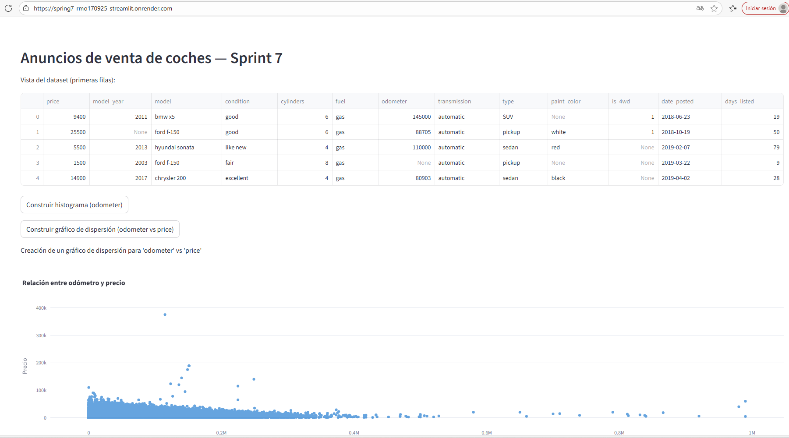

# spring7-RMO170925-streamlit

Construir y desplegar un panel de control de una aplicación web en un servicio en la nube.

# Anuncios de venta de coches — Sprint 7 (Streamlit)

Panel simple en Streamlit para visualizar el dataset `vehicles_us.csv`.

## 🎯 Funcionalidad
- **Encabezado** con título del panel.
- **Vista rápida** de las primeras filas del dataset.
- **Botón** para construir un **histograma** (`odometer`).
- **Botón** para construir un **gráfico de dispersión** (`odometer` vs `price`).

## 🗂️ Estructura del repositorio
├── README.md
├── app.py
├── vehicles_us.csv
├── requirements.txt
└── notebooks
└── EDA.ipynb

## ▶️ Ejecutar localmente

```bash
# Activar el entorno virtual (Windows PowerShell)
.\vehicles_env\Scripts\Activate

# Lanzar la app
streamlit run app.py
```

☁️ App desplegada
URL: https://spring7-rmo170925-streamlit.onrender.com



📦 Dependencias
Definidas en requirements.txt:

pandas

plotly

streamlit
